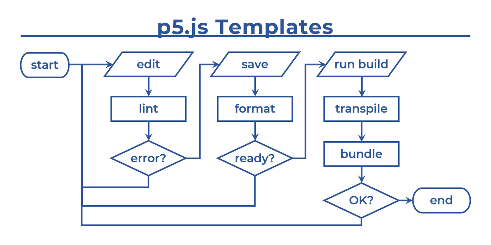

# より良いコーディング体験を。

<a href="https://twitter.com/intent/tweet?url=https://fal-works.github.io/p5js-templates/ja/&text=p5.js+Templates&hashtags=p5js" target="blank_"><strong>>> [ Tweet ]</strong></a>

[en](../) / **ja**

これは、[p5.js](https://p5js.org/) 用の GitHub テンプレートリポジトリーの集まりです。  
コードを書いてスケッチを作るのを快適にしてくれます。

次のように、いろいろな JavaScript 開発用ツールの助けを借りています。

||ツール|なにそれ|
|---|---|---|
|P|[Prettier](https://prettier.io/)|コードフォーマッター|
|E|[ESLint](https://eslint.org/)|リンター|
|T|[TypeScript](https://www.typescriptlang.org/)|型付き JavaScript|
|R|[Rollup](https://rollupjs.org/)|モジュールバンドラー|

とはいっても、すべてを使う必要があるわけではありません（下記テンプレートリスト参照）。

コードエディターとしては、[Visual Studio Code](https://code.visualstudio.com/)（略称 VS Code）の利用を想定しています。

## テンプレート一覧

状況と好みに応じてお好きに。

### [[ P ]](https://github.com/fal-works/p5js-template-p)

全てが自動的に美しくなります。[Prettier](https://prettier.io/) があなたのコードを整形します。

### [[ PE ]](https://github.com/fal-works/p5js-template-pe)

バグは少なく、可読性は高く。[ESLint](https://eslint.org/) があなたのコードをチェックします。

### [[ PET ]](https://github.com/fal-works/p5js-template-pet)

値の入れ間違い防止。より良いコード補完。コード自体がドキュメントに。そう、[TypeScript](https://www.typescriptlang.org/) ならね。

### [[ PER ]](https://github.com/fal-works/p5js-template-per)

ソースコードを複数のファイルに分けて構造化しましょう。[Rollup](https://rollupjs.org/) が最後にまとめてくれます。

### [[ PETR ]](https://github.com/fal-works/p5js-template-petr)

上の2つの組み合わせです。

### [[ PETR+ ]](https://github.com/fal-works/p5js-template-petr-plus)

脱・グローバル汚染。[p5.js インスタンスモード](https://github.com/processing/p5.js/wiki/Global-and-instance-mode) です。  
ついでに、[terser](https://terser.org/) で配布用のコードを圧縮します。

----

## さらなる詳細

### Git と GitHub

- [Git](https://git-scm.com/) とは、バージョン管理システム。コードの変更履歴を追跡したり、いろいろやってくれます。  
そして [GitHub](https://github.co.jp/) は、Git で管理されたコードを保管してくれるWeb上のプラットフォームです。

- Git は便利ですが、プログラミング初心者には少し難しいところがあるやもしれません。  
Git を使わない場合でも、p5.js テンプレートを GitHub からダウンロードすることは可能です。「Code」ボタン→「Download ZIP」をクリックしましょう。

- `.gitignore` ファイルは、Git で無視する（管理対象外にする）ファイルを指定するためのものです。  
Git を使わない場合はこのファイルも不要です。

- もし Git を使っていて、コードを GitHub に保管しているのなら、そのスケッチを [GitHub Pages](https://docs.github.com/en/free-pro-team@latest/github/working-with-github-pages) で公開できます。  
`docs` ディレクトリーを作り、そこに `index.html` と、そのなかでロードする他のファイルを置きます（いくつかのテンプレートはすでに同じことをしていて、`dist` ディレクトリーがそれです）。そして、`docs` ディレクトリーを公開するよう設定しましょう。

### VS Code の設定

- `.vscode` ディレクトリーには、[VS Code](https://code.visualstudio.com/) 向けの設定情報が入っています。

- Prettier と ESLint の自動実行を可能にしているのは `.vscode/settings.json` です。これとは別に、あなたの全プロジェクトに共通するグローバルな設定を書く場所もあるのですが、ローカルなほうの設定（各プロジェクトの `.vscode` の中のやつ）が優先されます。

- ちなみに VS Code にもデフォルトのフォーマッターが備わっています。多くの場合 Prettier のほうが有用だと思われますが、デフォルトのほうにしたくなるケースもあるかもしれません。

- いくつかのテンプレートでは、スケッチをビルドする（ここでは、ブラウザーで動かせる JavaScript ファイルを生成する）ために、コマンドラインで `npm run build` を実行する必要があります。  
このとき、手で書いて実行する代わりに、ショートカットキーの `Ctrl+Shift+B` か `⇧⌘B` を使うこともできます。これは `.vscode/tasks.json` のなかで定義されています。

### npm 関連のファイル

- [npm](https://docs.npmjs.com/) は、上で書いたツールを含め様々なパッケージをダウンロードできる、Web上の大きなデータベースです。同時に、パッケージ管理のツールも提供します（Node.js に含まれています）。そのツールというのは具体的には CLI、つまり `npm` コマンドです。

- `package.json` ファイルは、`npm` あるいはその他のパッケージ管理ツールを使うのに必要です。これには、各種メタデータ（パッケージ間の依存関係の情報とか）、そしてスクリプト（`scripts` という項目で自由に設定できて、コマンドラインで `npm run (スクリプト名)` として実行できる）などの情報が書いてあります。

- 各テンプレートの説明の中で、`npm` コマンドを使うよう書いてあるところがあります（Template P を除く）。このとき、代わりに [pnpm](https://pnpm.js.org/) を使うのもおすすめです。これらのテンプレートを作るときにも使われています。

- pnpm を使わない場合 `pnpm-lock.yaml` は無視して大丈夫です。依存パッケージをインストールするとき、デフォルトの `npm` は、代わりに `package-lock.json` を生成します。これらロックファイルはたぶんあなたにとって重要ではないと思われますが、気になる人はググってみるのも良いでしょう。

- npm 関連でなにかがうまく動かないときは、各種依存パッケージを再インストールしたうえで、VS Code を再起動してみてください。

### HTML/CSS

- [\<script\> タグ](https://developer.mozilla.org/en-US/docs/Web/HTML/Element/script) に `defer` 属性を追加すると、HTML パーサーを停止させずに JavaScript ファイルを非同期でロードできます。`async` 属性は使わないようにしましょう。p5.js の本体とスケッチの実行順序が重要なためです。

- 各テンプレートの CSS ファイルは、margin/padding をなくして、さらにキャンバスに `display: block` を設定します。これは、ウィンドウ全体を使うようなスケッチを作るときに役に立ちます。

- HTML 用の VS Code 拡張もいくつかあります。
    - [open in browser](https://marketplace.visualstudio.com/items?itemName=techer.open-in-browser) では、任意の HTML ファイルを VS Code から直接開くことができます。
    - スケッチのなかで何らかのアセットファイル（画像とか）をロードする場合、単純に HTML ファイルを開くだけだとうまく動きません。[Live Server](https://marketplace.visualstudio.com/items?itemName=ritwickdey.LiveServer) で開きましょう。これはさらに、JavaScript ファイルに変更が加えられるたびにページをリフレッシュしてくれます。

----

## 開発者Webサイト

[FAL Works - https://www.fal-works.com/](https://www.fal-works.com/) - Processing や p5.js のスケッチもいろいろあります。
