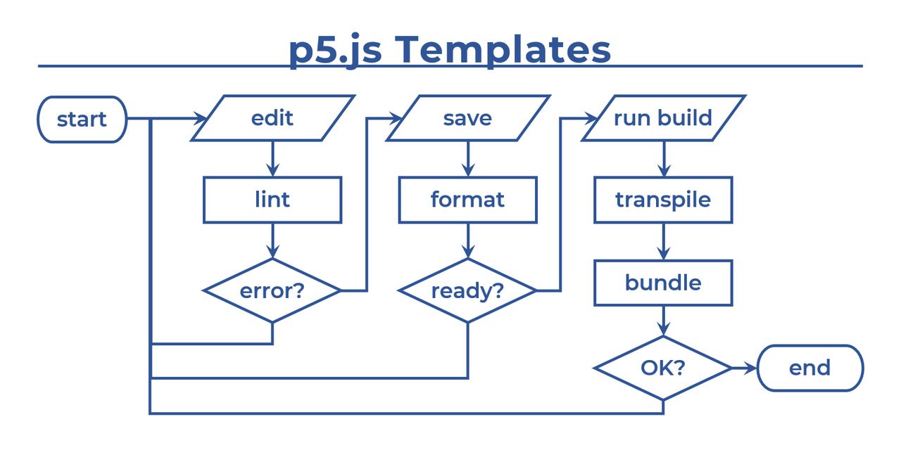

# より良いコーディング体験を。

[en](../) / **ja**

  <a href="https://twitter.com/intent/tweet?url=https://fal-works.github.io/p5js-templates/ja/&text=p5.js+Templates&hashtags=p5js" target="blank_">
    <strong>>> [ Tweet ]</strong>
  </a>

## 概要

これは、**[p5.js](https://p5js.org/)** 用の GitHub テンプレートリポジトリーの集まりです。  
コードを書いてスケッチを作るのを快適にしてくれます。

コードエディターとしては、[Visual Studio Code](https://code.visualstudio.com/)（略称 VS Code）の利用を想定しています。

また次のように、いろいろな JavaScript 開発用ツールの助けを借りています。

||ツール|なにそれ|
|---|---|---|
|P|[Prettier](https://prettier.io/)|コードフォーマッター|
|E|[ESLint](https://eslint.org/)|リンター|
|T|[TypeScript](https://www.typescriptlang.org/)|型付き JavaScript|
|R|[Rollup](https://rollupjs.org/)|モジュールバンドラー|

とはいっても、すべてを使う必要があるわけではありません（下記テンプレート一覧を参照）。

注：これらは完全な初心者向けではなく、JavaScript と p5.js の基本を知っている想定です。でもエキスパートである必要はまったくありません。

## テンプレート一覧

状況と好みに応じてお好きに。

### [[ P ]](https://github.com/fal-works/p5js-template-p)

全てが自動的に美しくなります。[Prettier](https://prettier.io/) があなたのコードを整形します。

### [[ PE ]](https://github.com/fal-works/p5js-template-pe)

バグは少なく、可読性は高く。[ESLint](https://eslint.org/) があなたのコードをチェックします。

### [[ PET ]](https://github.com/fal-works/p5js-template-pet)

値の入れ間違い防止。より良いコード補完。コード自体がドキュメントに。そう、[TypeScript](https://www.typescriptlang.org/) ならね。

### [[ PER ]](https://github.com/fal-works/p5js-template-per)

ソースコードを複数のファイルに分けて構造化しましょう。[Rollup](https://rollupjs.org/) が最後にまとめてくれます。

### [[ PETR ]](https://github.com/fal-works/p5js-template-petr)

上の2つの組み合わせです。

### [[ PETR+ ]](https://github.com/fal-works/p5js-template-petr-plus)

脱・グローバル汚染。[p5.js インスタンスモード](https://github.com/processing/p5.js/wiki/Global-and-instance-mode) です。  
ついでに、[terser](https://terser.org/) で配布用のコードを圧縮します。

----

## 基本用語

### Git と GitHub

[GitHub](https://github.co.jp/) は、Git で管理されたコードを保管してくれるWeb上のプラットフォームです。

そして [Git](https://git-scm.com/) とは、バージョン管理システムです。コードの変更履歴を追跡したり、いろいろやります。

Git を使うことは必須ではありません。Git はとても便利ですが、プログラミング初心者には少し難しいところもあるかもしれません。

### npm

[npm](https://docs.npmjs.com/) は、上で書いたツールを含め様々なパッケージをダウンロードできる、Web上の大きなデータベースです。

同時に、パッケージ管理のツール（`npm` コマンド）も提供します。  
[Node.js](https://nodejs.org/ja/) をインストールすることで、これが使えるようになります。

## テンプレートのダウンロード方法

上記のリンクから、任意のテンプレートの GitHub リポジトリーを開いてください。  
そして次のようにします。

### Git を使わない場合

- 「Code」ボタン→「Download ZIP」をクリックするだけです。

### Git を使う場合

1. 「Use this template」ボタンをクリックします。  
これはテンプレートをコピーして、あなたの所有となる新しいリポジトリーを作ります。
2. 「Code」ボタンをクリックして、リポジトリーをクローンするための URL を確認します。
3. `git clone` コマンドなどで、リポジトリーをクローンします。

----

## さらなる情報

### 目を通すとよいかもしれないこと

もしお役に立てば。

- [なんだこのファイル](./what-is-this-file.md)

- [ヒントとアドバイス](./tips.md)

- [TypeScript の機能を JavaScript のコードで使う](./use-ts-in-js.md)

### 上級者向け

こちらは上級者（もしくはそうなりたい人）向けの情報です。  

- [上級者向けトピックス](./advanced-topics.md)

ただしこれは、他のトピックが十分に簡単であることを意味しません。  
いずれにしろ、何かを学ぶというのは時間がかかるものです。

----

## リンク

- FAL Works - <https://www.fal-works.com/>

    p5.js Templates の開発者のWebサイト。Processing や p5.js のスケッチもいろいろあります。

- JavaScript用語集 開発環境関連 - <https://zenn.dev/fal/articles/js-dev-env-glossary-jan-2021>

    各種用語やツールなどの解説記事です。
