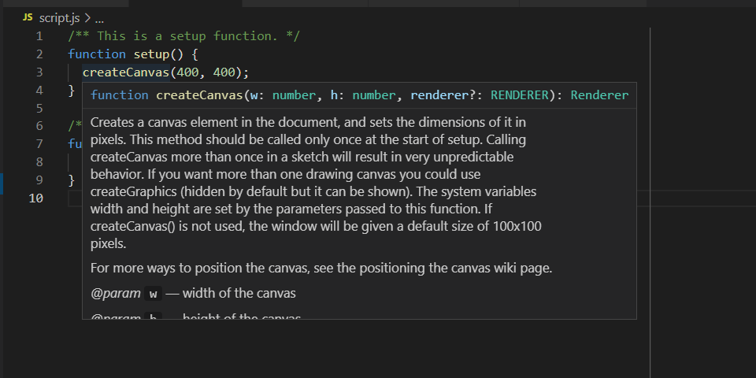

# TypeScript の機能を JavaScript のコードで使う

[VS Code](https://code.visualstudio.com/) は、それ自体がデフォルトで [TypeScript](https://www.typescriptlang.org/) を強力にサポートしています。  
たとえ TypeScript を使わなくても、JavaScript コードを書くときにその恩恵を受けられます。


## 型宣言を使う

[@types/p5](https://www.npmjs.com/package/@types/p5) は p5.js 用の型宣言です。これは TypeScript を使いながら p5.js のスケッチを作るときに必要になるものです。

ですが、この型宣言は JavaScript でコードを書くときにも役に立ちます。p5.js のリファレンス、つまり各種関数などの説明が埋め込まれていて、それを利用できるのです。

### 準備

`package.json` が存在しない（これは Template P が該当する）場合は、まず以下を行います。

- [pnpm](https://pnpm.js.org/) を使っていない場合、スケッチのフォルダー内に `package.json` を新しく作ります。  
内容は空のオブジェクト `{}` でよいです。
- [Git](https://git-scm.com/) を使っていて、かつ `.gitignore` が存在しない場合、これもフォルダー内に作ります。  
そして一行、`node_modules/` を追加します。このディレクトリーを無視するためです。

### 使いかた

まず @types/p5 をインストールします。  
`npm install -D @types/p5` または `pnpm add -D @types/p5` です。

そして、スケッチのフォルダー内に `tsconfig.json` ファイルを新たに作ります。  
内容は次のようなかんじです。

```json
{
  "compilerOptions": {
    "allowJs": true,
    "target": "ES2015",
    "types": ["p5/global"],
    "noEmit": true
  }
}
```

これで、マウスホバーで p5.js の関数の情報が見られるし、コード補完も効くようになります。




## 型チェックを行う

上のようにして `tsconfig.json` を作ると、JavaScript コードに対して型チェックを行うこともできるようになります。

`tsconfig.json` に `checkJs` を足してみましょう。

```json
{
  "compilerOptions": {
    "allowJs": true,
    "checkJs": true,
    "target": "ES2015",
    "types": ["p5/global"],
    "noEmit": true
  }
}
```

こうすると、下記のコードはエラーを出し、それはエディター上に表示されます。

```js
let someNumber = 42; // 数値で初期化
someNumber = "1984"; // その後、文字列を入れる（できません）
```

これはバグを予防するのにとても有効です。

そしてもちろん、このようなケースだけではありません。たとえば `Cannot read property ‘...’ of undefined` みたいなエラーで悩むことも大幅に減るでしょう。重要なのは、ほとんどのエラーが、プログラムを実行しなくてもコードを書いた直後に発見できるというところです。

しかし、もっと複雑な型が必要になることもあるかもしれません。たとえば上述のコードのようなことを意図的に行いたい場合です。そのようなケースでは TypeScript の利用が必要です。有効な TypeScript コードの例は、次のようなものです。

```ts
let someNumberlike: number | string = 42; // 数値も文字列も使えるように宣言する
someNumberlike = "1984"; // これで文字列も代入できる
```
